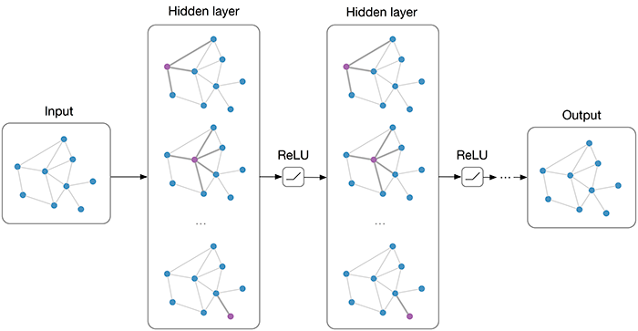

# Capstone Proposal
## Graph Neural Network (PyG)
### Proposed by: Dr. Amir Jafari
#### Email: ajafari@gwu.edu
#### Advisor: Amir Jafari
#### The George Washington University, Washington DC  
#### Data Science Program

## 1 Objective:  
 
            PyG (PyTorch Geometric) is a library built upon PyTorch to easily write and train Graph Neural Networks 
            (GNNs) for a wide range of applications related to structured data. It consists of various methods for deep
            learning on graphs and other irregular structures, also known as geometric deep learning (https://pyg.org/blogs-and-tutorials). 
            The goal of this project is to use PyG package on  Biology, Computer Vision, Finance, Language Models, Modeling Physical systems,
            Knowledge Graphs, Fraud detection and social network analysis. The package has great documentation which need
            to be used as ground work for understanding the PyG and use that toward one of the above applications. Finally, 
            we will find a set of data that fits the application and compare it with deep learning methods and develop
            a comparative study of the GNN and Deep Learning techniques.
            

*Figure 1: Caption*

## 2 Dataset:  

            The publicly available data for each application needs to be find in Kaggle Dataset or any source of data.
            

## 3 Rationale:  

            This project is going to help machine learning and deeplearning researches to understand GNN by comparing it
            with other available methods. 

            

## 4 Approach:  

            I plan on approaching this capstone through several steps.  
            
            1. Design folder structure for the repo GNN.
            2. Create a basic GNN code (basic code: Data loaders, models)
            3. Create modular and reusable codes. 
            4. Work on specific application (any of applications which is mentioned).
            5. Create a tutorial and slides for the specific GNN.
            6. Use external dataset and compare results with DL models.
            7. Write a journal paper.
            8. Create a documentation for each application with slides, basic codes and final application training code.
            

## 5 Timeline:  

            This a rough time line for this project:  
            
            - (1 Weeks) Create folder structure.  
            - (3 Weeks) Basic GNN code and documentation 
            - (1 Weeks) Modular reusable class and functions.  
            - (1 Weeks) Pick and application and do a literature review.
            - (2 Weeks) Tutorial and slides for specific application
            - (3 Weeks) Find external dataset and train the network (comparative study)
            - (2 Weeks) Expand the GNN through different set of data and show the power of GNN.
            - (2 Weeks) Write a paper.
            

## 6 Expected Number Students:  

            For this project maximum 8 students can work on it.  
            

## 7 Possible Issues:  

            The challenge is understanding the GNN in great details. Solve realworld problem and create through examples
            that it shows the power of GNN. 
            

## Contact
- Author: Amir Jafari
- Email: [ajafari@gmail.com](Eamil)
- GitHub: [https://github.com/amir-jafari/Capstone](Git Hub rep)
